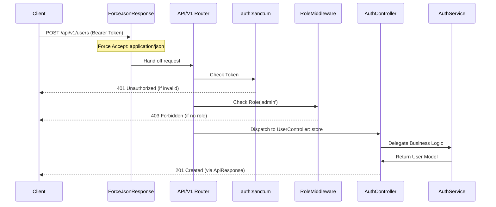

# Project Lifecycle & Flow

This document details the specific architectural choices and lifecycle of a request within this API-centric Laravel application. It goes beyond standard Laravel docs to explain **how** we use specific components like Sanctum, versioning strategies, and custom RBAC middleware.

## 1. Authentication & Token Lifecycle (Sanctum)

This project uses **Laravel Sanctum** for API authentication, but with a specific implementation pattern via `AuthService`.

### 1.1 Token Generation (Login/Register)

Tokens are **not** auto-generated by a route closure. The flow is:

1.  **Request**: `POST /api/v1/auth/login`
2.  **Controller**: `AuthController::login` validates input.
3.  **Service**: `AuthService::login` performs the credentials check.
4.  **Creation**: On success, `$user->createToken('auth-token')->plainTextToken` is called.
    - **Token Name**: `'auth-token'` (Hardcoded in Service).
    - **Payload**: Returns a structured array `{ user: User, token: string }`.

### 1.2 Token Verification (Protected Routes)

Protected routes use the `auth:sanctum` middleware alias.

- **Mechanism**: The `EnsureSanctumToken` middleware (configured in `bootstrap/app.php` but currently commented out in favor of standard `auth:sanctum` route group) checks the `Authorization: Bearer <token>` header.
- **Guard**: default `web` guard is configured for Sanctum in `config/sanctum.php`.
- **Expiration**: Configured via `SANCTUM_TOKEN_EXPIRATION` env variable. If null, tokens never expire.

## 2. Custom Middleware Pipeline

Beyond standard Laravel middleware, this project relies on a few critical custom middlewares:

### 2.1 ForceJsonResponse (`App\Http\Middleware\ForceJsonResponse`)

- **Why**: To prevent Laravel from rendering HTML error pages (like 404 or 500) which breaks API clients.
- **How**: Running **globally** on all API routes, it forcefully inserts `Accept: application/json` into the request headers _before_ the application handles it. This ensures exceptions render as JSON.

### 2.2 Role & Permission Gates (`App\Http\Middleware\RoleMiddleware`)

- **Usage**: Assigned as route aliases `'role'` and `'permission'`.
- **Logic**:
    - Checks `!$request->user()` first -> returns 401.
    - Checks `$user->hasAnyRole($roles)` -> returns 403 Forbidden with message "Required role: X".
    - **Note**: This relies on the `Spatie\Permission\Traits\HasRoles` trait on the `User` model.

## 3. Versioning Strategy

The project implements **URI-based versioning** (e.g., `/api/v1/...`).

### 3.1 Bootstrap Configuration

- **File**: `bootstrap/app.php`
- **Setup**: The `api` parameter points to `routes/api.php`, implementing a global prefix of `/api` (default Laravel 11 behavior).

### 3.2 Recursive Route Loading

- **Level 1**: `routes/api.php` acts as a dispatcher. It defines the `/v1` prefix group and loads...
- **Level 2**: ...`routes/api/v1.php`. This file contains the actual endpoints for Version 1.
- **Benefit**: This strict separation allows introducing `routes/api/v2.php` in the future without touching existing logic.

## 4. Request Lifecycle Diagram

