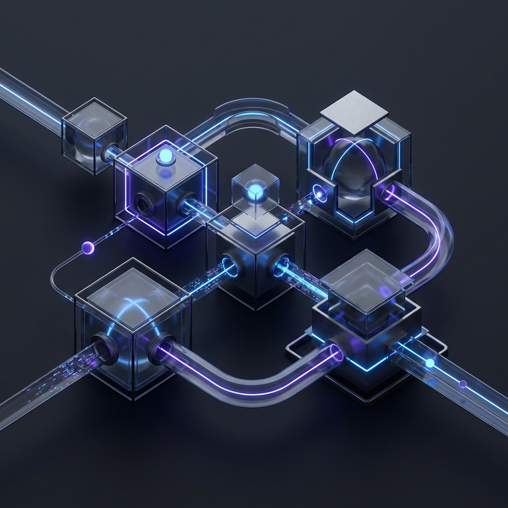

# Laravel API Boilerplate

A production-ready, highly standardized Laravel API boilerplate built with **Laravel 11**, focusing on strict type safety, modular architecture, and modern developer ergonomics.

---

## Architectural

This project follows a strict **Service-Driven Architecture** to ensure maintainability, testability, and scalability.

- **Strict Typing**: `declare(strict_types=1);` is enforced across the entire codebase.
- **Service Layer**: All business logic is extracted from controllers into dedicated Service classes.
- **API Versioning**: Built-in support for versioned routing (V1, V2, etc.).
- **Standardized Responses**: Global JSON response format for consistency across all endpoints.
- **Security First**: Hardened with Sanctum authentication, role-based access control, and secure headers.
- **Smart Scaffolding**: Custom Artisan command to generate entire feature modules in seconds.

---

## Folder Structure

In addition to the standard Laravel 11 directory layout, this project utilizes a specialized structure to support its service-driven and versioned API architecture:

```
app/
├── Console/Commands/      # Custom Artisan commands (e.g., make:api-module)
├── Http/
│   ├── Controllers/Api/   # Versioned API Controllers (V1, V2, etc.)
│   ├── Requests/Api/      # Versioned Form Requests
│   └── Resources/Api/     # Versioned API Resources
├── Services/              # Business logic layer
├── Models/                # Database models
├── Traits/                # Shared logic traits
└── Observers/             # Model event observers

database/
├── migrations/            # Database schema
├── factories/             # Model factories
└── seeders/               # Database seeders

docs/
└── api-modules/           # Feature-specific documentation

git-hooks/                 # Pre-commit hook configurations
scripts/                   # Project utility scripts (e.g., setup-project.sh)
tests/                     # Feature and Unit tests
```

---

## Tech Stack

- **Framework**: [Laravel 11.x](https://laravel.com)
- **Auth**: [Laravel Sanctum](https://laravel.com/docs/sanctum)
- **Database**: MySQL / PostgreSQL / SQLite
- **Code Quality**: [Laravel Pint](https://laravel.com/docs/pint)
- **Static Analysis**: [PHPStan](https://phpstan.org/)
- **Testing**: [PHPUnit 11](https://phpunit.de/)

---

## Getting Started

### Prerequisites

- PHP 8.2+
- Composer
- Database (MySQL/SQLite)

### Installation

1.  **Environment Setup**:
    Copy the `.env.example` file and rename it to `.env`:

    ```bash
    cp .env.example .env
    ```

2.  **Database Configuration**:
    Open `.env` and update the database credentials (`DB_DATABASE`, `DB_USERNAME`, `DB_PASSWORD`) to match your local setup.

3.  **Run Setup Script**:
    Provide necessary permissions to the setup script and execute it. This script handles dependency installation, key generation, and git hooks:

    ```bash
    chmod +x scripts/setup-project.sh && ./scripts/setup-project.sh
    ```

4.  **API Tool Setup**:
    Setup your Postman workspace or any other API tool by importing the project variables.

5.  **Hit the API**:
    Start the local server and hit the base endpoint:
    ```bash
    php artisan serve
    ```
    Base URL: `http://localhost:8000/api/v1`

---

## Development Workflow

### Quick Scaffolding

We use a custom, high-level scaffolding command to ensure every new feature follows our architectural standards.

Generate a full API module (Controller, Service, Resource, Request, Model, Test, Docs):

```bash
php artisan make:api-module Product
```

**What this generates:**

- `app/Http/Controllers/Api/V1/ProductController.php`
- `app/Services/ProductService.php`
- `app/Http/Resources/Api/V1/ProductResource.php`
- `app/Http/Requests/Api/V1/ProductRequest.php`
- `app/Models/Product.php` & Migration
- `tests/Feature/Api/V1/ProductTest.php`
- `docs/api-modules/Product.md`

---

## Quality & Testing

### Running Tests

We enforce rigorous testing for all API endpoints.

```bash
php artisan test
```

### Code Formatting

Maintain consistent code style using Laravel Pint.

```bash
./vendor/bin/pint
```

### Static Analysis

Catch potential bugs early with PHPStan.

```bash
./vendor/bin/phpstan analyse
```

### Git Pre-commit Hook

The project includes a robust Git pre-commit hook to ensure that every commit meets the project's quality standards. When you run `git commit`, the following checks are performed automatically:

- **Prettier**: Auto-formats file structure and assets.
- **Laravel Pint**: Auto-formats PHP code to follow standard styling.
- **Static Analysis**: Runs Larastan to catch potential bugs and type mismatches.
- **Full Test Suite**: Executes all PHPUnit tests to ensure no regressions are introduced.

If any check fails, the commit is aborted, allowing you to fix the issues before they enter the repository.

---

## Documentation

Systematic module documentation is maintained in the `/docs` directory.

- [API Module Docs](docs/api-modules)
- [Architecture Overview](docs/ARCHITECTURE.md) (Optional)

---

## License

The Laravel framework is open-source software licensed under the [MIT license](https://opensource.org/licenses/MIT).
