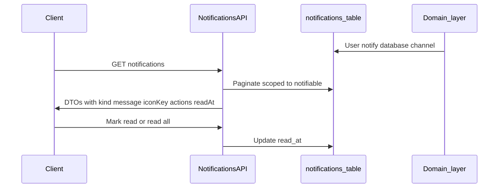

# Notifications system — product and technical plan

**Status:** **Implemented** — member feed, read/read-all, summary, profile-view + new-match notifications; see [`member_notifications_api.md`](member_notifications_api.md).

**Related:** Contact request flows and payloads are documented in [`candidate_contact_requests_api.md`](candidate_contact_requests_api.md).

---

## Product goals (LinkedIn-style feed)

Each notification row in the client should support:

- **Icon** — map from a stable `iconKey` (or `data.kind`) to local/remote assets.
- **Message** — primary copy (headline + optional secondary line).
- **Time** — from `created_at` (relative formatting on client).
- **Actions** — for **new contact request**: primary actions such as **Accept** and **Reject** (call existing contact-request API), plus **View message** (full `request_message` either embedded in the feed item or loaded via a detail view).
- **Other kinds** — **New match**, **Profile viewed**, **Contact request accepted**: deep links or CTAs as appropriate (no Accept/Reject except for pending contact requests).

---

## HTTP APIs (implemented)

| Endpoint (conceptual)                                  | Purpose                                                                                                                                |
| ------------------------------------------------------ | -------------------------------------------------------------------------------------------------------------------------------------- |
| `GET /api/v1/auth/notifications`                       | List notifications for the authenticated user with pagination (`cursor` or `page`), optional `unread_only`, sort by `created_at` desc. |
| `PATCH` or `POST /api/v1/auth/notifications/{id}/read` | Mark one notification read (`id` = notification UUID, Laravel `notifications.id`).                                                     |
| `POST /api/v1/auth/notifications/read-all`             | Mark all unread notifications for the user as read.                                                                                    |
| `GET /api/v1/auth/notifications/{id}` (optional)       | Single notification, same DTO as list item — useful for deep links; often unnecessary if list payload is complete.                     |

**Validation**

- **List / read:** Sound. Scope every query to `notifiable_id` + `notifiable_type` for the current user; return **403** if `{id}` belongs to another user.
- **Contact request “message details”:** Usually **redundant** if `request_message` is already stored in `data` for `contact_request_received` (see `App\Notifications\ContactRequestReceivedNotification`). Prefer including the full message in the **list** response; add a detail endpoint only if payloads grow large.

**Suggested additions**

- **Unread badge:** `GET /api/v1/auth/notifications/summary` with `{ "unreadCount": n }` or include `meta.unreadCount` on the list response.
- **Stable `data.kind`** on every notification so clients do not parse Laravel’s `type` FQCN.
- **`actions` in API JSON** (derived server-side), e.g. `{ "action": "accept_contact_request", "method": "PATCH", "path": "/api/v1/auth/candidate/contact-requests/{uuid}", "body": { "decision": "accepted" } }` so web/mobile stay aligned.
- **Pagination:** cursor-based on `(created_at, id)` for large inboxes.
- **Throttle** list and mark-read endpoints.

---

## Data model (existing)

Laravel standard **`notifications`** table:

- `id` (UUID, primary key)
- `type` (notification class name)
- `notifiable_type`, `notifiable_id` (polymorphic owner, typically `User`)
- `data` (JSON from `toArray()` / database channel)
- `read_at`, `created_at`, `updated_at`

No schema change required for the proposed feed; optional future columns (e.g. `expires_at`) are out of scope unless product needs soft-delete or TTL.

---

## Notification kinds (v1 target)

| `data.kind`                | When                          | Notes / suggested `data` fields                                                                                                                                                                                                                                                                            |
| -------------------------- | ----------------------------- | ---------------------------------------------------------------------------------------------------------------------------------------------------------------------------------------------------------------------------------------------------------------------------------------------------------- |
| `contact_request_received` | Someone requests your contact | Implemented; includes `contact_request_uuid`, from-user identity, `request_message`, human `message`.                                                                                                                                                                                                      |
| `contact_request_accepted` | Recipient accepted            | Implemented; includes `contact_request_uuid`, to-user identity, `message`.                                                                                                                                                                                                                                 |
| `new_match`                | New active match row          | **Not implemented** — add `NewMatchNotification`; suggest `match_uuid`, `other_user_uuid`, `other_user_name`, optional `match_percentage`.                                                                                                                                                                 |
| `profile_viewed`           | Someone opened your profile   | **Not implemented** — requires **recording** `profile_views` (table exists; app writes not wired) plus `ProfileViewedNotification`. Suggest `viewer_user_uuid`, `viewer_name`, `source` (e.g. `profile_details`). Default recommendation: **named** viewer for v1; optional later flag for anonymous copy. |

**Filtering in the UI:** Other database notifications exist (e.g. welcome email also uses the `database` channel). Clients should filter by `data.kind` and/or allowlist `type` class names.

---

## Current codebase gaps

1. **Contact requests** — Notifications already sent from `App\Services\ContactRequestService`.
2. **`profile_views`** — Migration exists (`2026_04_30_107000_create_user_interaction_tables.php`); **no application writes** yet (only report aggregates read the table). Plan: insert on relevant “view profile” server action (e.g. candidate viewing another candidate’s profile details), then notify the profile owner (subject to rate limits / deduplication if needed).
3. **Matches** — `CandidateMatchService` / `matches` table; **no notification** on create. Plan: fire `NewMatchNotification` when appropriate (product: notify **both** users vs one side only).

---

## Architecture (high level)

---

## Implementation outline (when development starts)

- **Routes:** Under `/api/v1/auth/…` with `auth:sanctum` and `tracked.session` (same as other member routes), prefix e.g. `notifications`.
- **Controller + service:** Thin controller; `NotificationFeedService` (or similar) maps `DatabaseNotification` rows to a **stable camelCase JSON** shape (`iconKey`, `message`, `createdAt`, `readAt`, `kind`, `rawData` or merged fields, `actions`).
- **Security:** Never expose another user’s notifications; use route-model binding or manual lookup + ownership check.
- **Contact request actions:** Reuse `PATCH /api/v1/auth/candidate/contact-requests/{uuid}` with `decision` `accepted` / `rejected` (see [`candidate_contact_requests_api.md`](candidate_contact_requests_api.md)).
- **Tests:** Pagination, read one, read all, 403 on foreign notification id, DTO shape per `kind`.

---

## Open product choices

- **New match:** Notify both matched users vs only one.
- **Profile viewed:** Real-time per view vs daily digest (real-time is simpler for v1).
- **Retention:** Cron to prune old notifications vs keep indefinitely.

---

## Revision history

- Initial plan documented from engineering review; APIs explicitly **not** implemented as part of authoring this file.
